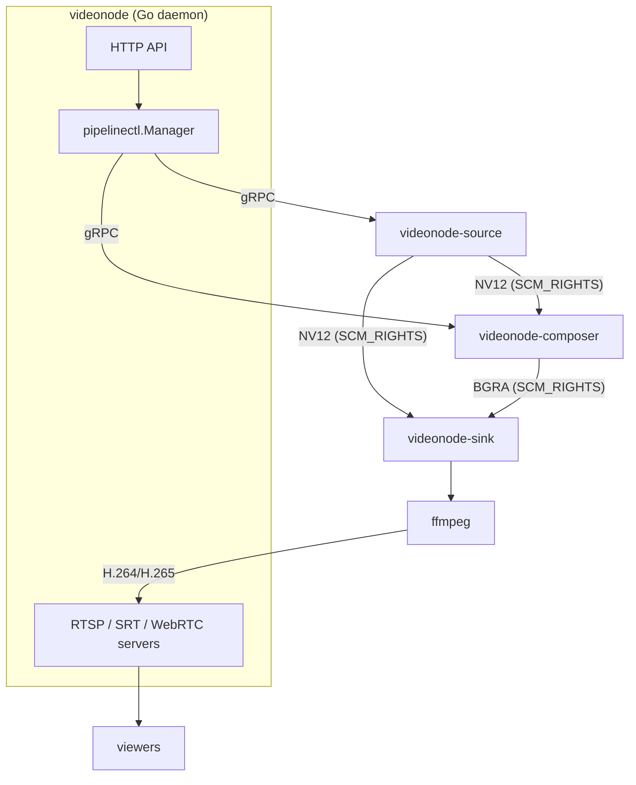

# Architecture

This page explains why VideoNode is structured as a Go daemon that supervises native C++ subprocesses, rather than a monolithic binary. It does not walk through setup steps. See [building](./building) for that, or [pipeline model](../reference/pipeline-model) for entity-level semantics.

## Why separate native binaries?

V4L2 capture, RGA color-space conversion, and EGL/GLES GPU compositing are CPU- and kernel-interface-heavy workloads that cannot run safely inside a Go process. Go's runtime scheduler conflicts with the real-time V4L2 buffer queue, and cgo boundaries at frame rate introduce latency spikes. Running the video work in separate C++ processes with dedicated OS threads eliminates both problems. The Go daemon manages policy and the HTTP API; the C++ binaries handle frames.

The three binaries are:

- `videonode-source`: V4L2 capture and RGA NV12 conversion, one process per source ID. Broadcasts NV12 dma-bufs to up to 16 consumers over a Unix socket.
- `videonode-composer`: EGL/GLES GPU compositor on Mali-G610. Reads NV12 dma-bufs from one or more source sockets and produces a BGRA canvas frame.
- `videonode-sink`: single-stream NV12 carrier. Dials a source socket and writes raw NV12 bytes to stdout for piping into ffmpeg.

## Zero-copy frame passing with SCM_RIGHTS

Copying video frames over pipes at 30–60 fps would saturate memory bandwidth. Instead, `videonode-source` passes dma-buf file descriptors to consumers using `SCM_RIGHTS` ancillary data on a Unix socket. The consumer mmaps the kernel buffer directly, with no copy and no intermediate allocation. A serialized `dmabuf_msg::Header` (NV12 plane offsets, pitches, frame index) precedes the file descriptors on the byte stream. This wire format is defined in `composer/src/scm_rights_producer.cpp` and `scm_rights_source.cpp`; it is not compatible with the GStreamer `unixfdsrc` wire format.

Because `SCM_RIGHTS` supports N receivers on one socket, a single `videonode-source` can simultaneously feed a `videonode-composer` and one or more `videonode-sink` instances without any frame duplication.

## Per-instance gRPC control plane

The daemon needs to reconfigure running processes (swapping the V4L2 device, updating canvas dimensions, pushing layout changes) without restarting them. A daemon-wide message bus would serialize all control RPCs through one bottleneck; a per-instance Unix-domain socket keeps each binary's control path independent. The daemon dials each socket immediately after spawning the binary, calls `Describe()` to record PID and protocol version, then issues unary control RPCs as needed.

Sources expose: `SetFormat`, `SetDevice`, `GetStatus`, `StreamStatus` (server-streaming status push), `Snapshot`, `Shutdown`.

Composers expose: `SetCanvas`, `SetSource`, `ClearSource`, `SetLayout`, `SetEffects`, `SetSourceState`, `GetStats`, `Snapshot`, `Shutdown`.

The `StreamStatus` stream is the only long-lived RPC. The source pushes a `Status` frame on health change, on consumer-count change, and once per second as a heartbeat. The daemon's `pipelinectl.Manager` pumps these onto a buffered channel for the SSE fan-out path.

Wire schemas live in `proto/control/source.proto` and `proto/control/composer.proto`. Generated Go stubs are in `internal/streams/pipelinectl/pb/`.

## Process supervision contract

`videonode-source` sets `PR_SET_PDEATHSIG` so it receives `SIGTERM` if the daemon exits without a clean shutdown, preventing orphan processes. Sinks and composers reconnect to their source socket with 100 ms backoff for up to 30 s if the producer restarts. A sink crash does not take the source down. The daemon's `pipelinectl.Manager` evicts a source from its registry after 30 s of unresponsive `StreamStatus` reconnects.

## Relationship diagram

<!-- depicts: internal/streams/pipelinectl/manager.go:Manager + composer/README.md binary triad (rev as of 2deefb9) -->

For entity-level semantics (source, composer, stream lifecycles and CRUD), see [pipeline model](../reference/pipeline-model).
