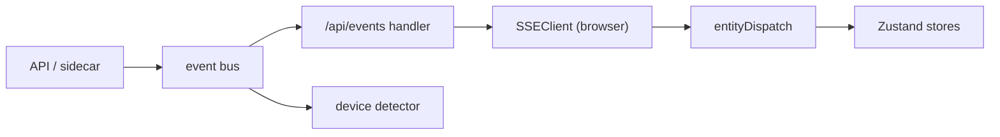

# Events and SSE

This page explains how VideoNode delivers real-time UI updates: the in-process event bus, the two Server-Sent Events (SSE) streams, and the uniform event envelope. For the REST surface that SSE complements, see [the REST API](../reference/rest-api).

## The event bus

The daemon runs one in-process publish/subscribe bus (`internal/events`, wrapping `kelindar/event`). Producers call `events.Publish(bus, ev)`; consumers call `events.Subscribe(bus, fn)`. The concrete Go type selects the delivery topic, so adding an event type needs no change to the bus itself.

The bus is the hub, not the wire. SSE is one subscriber that bridges bus events to the browser. Other subscribers stay in-process: the device detector reacts to `StreamCrashedEvent` to recheck the HDMI signal and never touches SSE. Keeping the bus separate from SSE lets in-process reactions and browser pushes evolve independently.

## The two SSE streams

| Endpoint | Carries | Replay |
|---|---|---|
| `/api/events` | entity envelope, global events, heartbeat | none |
| `/api/logs/stream` | structured log records | ring buffer, then live |

`/api/events` is the multiplexed real-time feed. `/api/logs/stream` is separate because logs need backfill (the ring buffer) and a larger client buffer.

## The entity envelope

Every per-entity update rides one wire schema:

```json
{
  "entity_type": "source",
  "id": "cam-lobby",
  "action": "status",
  "payload": {},
  "timestamp": "2026-05-29T10:30:00Z"
}
```

`entity_type` is `source`, `composer`, or `stream`. `action` is one of:

- `created`, `updated`, `deleted`: lifecycle. Payload is the full entity snapshot, or absent on delete.
- `status`: a runtime health snapshot from a sidecar.
- `metrics`: fps, dropped frames, bitrate.
- `consumers`: the per-client reader set.

The UI discriminates on `(entity_type, action)` in one dispatcher (`ui/src/hooks/entityDispatch.ts`), so a new entity costs one map entry rather than a new event handler. Lifecycle events trigger a dependency fan-out: when a stream's upstream changes, `Registry.Touch` re-loads and republishes the affected source so its denormalized `consumers` rollup stays correct.

## Global events

Three events sit outside the envelope because they are not per-entity:

- `device-discovery`: a V4L2 device was added, removed, or changed. The UI refetches the device list.
- `pipeline-state-changed`: the daemon master switch toggled.
- `heartbeat`: emitted every 15 seconds to keep proxies and idle clients alive.

## Delivery and backpressure

Each SSE client gets a bounded channel. If a client falls behind, the bus drops events for it rather than blocking the publisher, so no slow reader can stall the daemon. SSE is therefore best-effort: the client treats a reconnect as a resync point and refetches over REST (the connection-status handler refetches streams on the transition back to online).

## What is live versus polled

Different data uses different freshness mechanisms, one source of truth per datum:

| Data | Mechanism |
|---|---|
| Stream, source, composer lifecycle / status / metrics / consumers | entity envelope on `/api/events` |
| Device list | `device-discovery` event, plus a 30s fallback poll |
| Pipeline switch | `pipeline-state-changed` event |
| Live preview | MJPEG stream (`/api/sources/{id}/preview.mjpg`) |
| Daemon CPU / memory, process list | `processes` event on `/api/events` (the daemon is a `self` row), seeded and resynced over `/api/processes` |
| Encoder capabilities, health | one-shot REST on load (boot-static) |

Per-entity runtime data rides the envelope, whole-daemon and per-process stats ride the `processes` event (which includes a `self` row for the daemon itself, so the operator status bar needs no separate poll), and boot-static capabilities are fetched once. The composer sidecar does not push status, so the UI shows composer process state from lifecycle events but no live canvas or consumer telemetry.

## Authentication

`EventSource` cannot set request headers, so the client passes credentials as a query parameter: `/api/events?auth=<base64(user:pass)>`. Serve the daemon over HTTPS so the query string is encrypted in transit.

## Frontend flow

<!-- depicts: internal/events/registry.go + ui/src/hooks/entityDispatch.ts (rev as of 26dec87) -->



The browser keeps one `SSEClient` (`ui/src/lib/api.ts`), shared by every component through `useSSEManager`. On error it reconnects with exponential backoff from 5s to 60s. `entityDispatch` routes each envelope into the matching store's `applyEntityEvent`.
