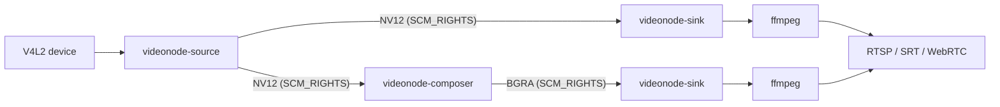

# Introduction

This page explains what VideoNode is and how its three-entity pipeline model works. For step-by-step setup, see [Installation](./installation) and [Quickstart](./quickstart).

VideoNode is a self-hosted video streaming server for Linux. It takes frames from V4L2 capture devices — webcams, HDMI capture cards — and publishes them as RTSP, SRT, and WebRTC streams. Because it runs headless and ships as a single binary plus native C++ pipeline binaries, it targets single-board computers like Orange Pi and Raspberry Pi. The daemon detects connected devices automatically, validates available hardware encoders, and builds FFmpeg pipelines from a declarative TOML config.

## Three-entity pipeline model

VideoNode v2 organises every pipeline into three independent entities. Each has its own identity, CRUD surface, and lifecycle. Streams reference upstream entities by explicit ID — there is no monolithic block that bundles capture, composition, and encoding together.

- **Source** — captures V4L2 frames from one device (or generates a test pattern when `test_mode = true`) and broadcasts raw NV12 frames to any number of consumers. A source runs as a separate `videonode-source` process per source ID.
- **Composer** — reads frames from one or more sources, composites them onto a BGRA canvas using GLES, and broadcasts the result. Multiple streams can share one composer: the GPU does the compositing work once, and each stream pays only its own encoder cost. A composer is optional; streams that need no compositing reference a source directly.
- **Stream** — pairs an upstream reference (`"source:<id>"` or `"composer:<id>"`) with an encoder config and publish targets (RTSP, SRT, WebRTC). The encoder process spawns lazily when the first viewer connects and stops after the last one disconnects.

<!-- depicts: examples/sources-composers-streams.toml, CLAUDE.md §"Pipeline model" -->

The config that drives this model uses three TOML tables — `[[sources]]`, `[[composers]]`, and `[[streams]]` — with `upstream` fields for the references. For the full entity model and lifecycle details, see the [pipeline model reference](../reference/pipeline-model).
