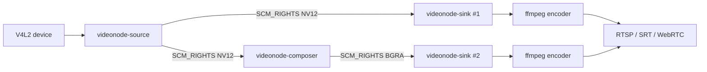

# Introduction

_Placeholder — populated by Phase B._

## Pipeline model (preview)

```mermaid
flowchart LR
    V4L2[V4L2 device] --> src[videonode-source]
    src -- "SCM_RIGHTS NV12" --> comp[videonode-composer]
    src -- "SCM_RIGHTS NV12" --> sink1[videonode-sink #1]
    comp -- "SCM_RIGHTS BGRA" --> sink2[videonode-sink #2]
    sink1 --> ff1[ffmpeg encoder] --> rtsp[RTSP / SRT / WebRTC]
    sink2 --> ff2[ffmpeg encoder] --> rtsp
```
