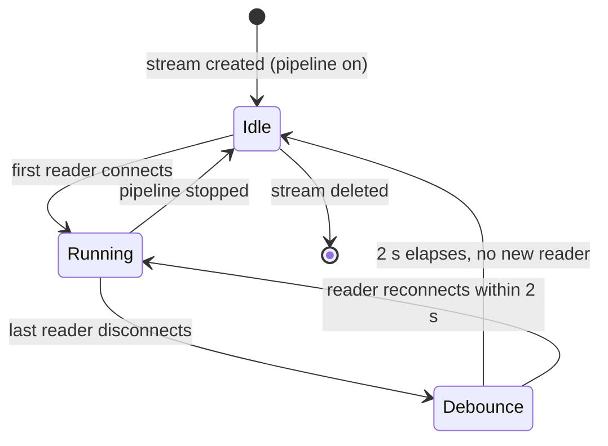

# Pipeline model

This page explains *why* VideoNode organises its runtime around three independent entities and what the lifecycle rules mean in practice. State is managed via the UI or [REST API](./rest-api); you should not need to read or edit the daemon's on-disk format directly.

## Three independent entities

Sources, composers, and streams are top-level objects with separate identities and CRUD surfaces. They reference each other by explicit string (`"source:<id>"` or `"composer:<id>"`), not by containment. This separation means you can add or remove streams without touching a source, and rearrange a composer layout without restarting an encoder.

- **Source** — one `videonode-source` process per source, capturing V4L2 frames (or emitting a test pattern) and broadcasting NV12 dma-bufs to N consumers over SCM_RIGHTS sockets.
- **Composer** — one `videonode-composer` process per composer, reading N source sockets, compositing onto a BGRA canvas via OpenGL ES, and broadcasting the result.
- **Stream** — one `vn-sink | ffmpeg` encoder per stream, dialing an upstream source or composer socket and publishing to RTSP, SRT, or WebRTC.

## Pipeline-gated lifecycle (sources and composers)

Sources and composers are **pipeline-gated**: they run while the daemon-wide pipeline switch is on and stop when it is off. The switch is a single toggle in the UI (or `POST /api/pipeline/start` / `POST /api/pipeline/stop`). CRUD — creating, patching, or deleting entities — works regardless of switch state and persists immediately; on the next pipeline start, everything rehydrates from the store.

While the pipeline is on, sources and composers stay up until you delete them. Streams attaching or detaching do not restart them.

## Lazy-encoder-on-reader lifecycle (streams)

Streams exist as a persistent **plan**, but the actual `vn-sink | ffmpeg` encoder process only runs when someone is watching. When the first reader (RTSP client, SRT listener, WebRTC peer) connects, the daemon calls `Pipeline.EnsureEncoder` and the encoder spawns. When the last reader disconnects, a 2-second debounce fires (`lastReaderDebounce = 2 * time.Second` in `internal/streaming/server.go`) and the encoder stops. A reader reconnecting within that window cancels the timer — the encoder stays warm.

This is deliberate: a hardware H.264 encoder slot and a V4L2 capture session are finite resources on an SBC. Holding them open for zero viewers wastes memory and device bandwidth.

<!-- depicts: internal/streaming/server.go:lastReaderDebounce, internal/streams/pipeline/pipeline.go:EnsureEncoder -->

## Reference integrity

The three entities form a directed graph: streams point at composers or sources; composers point at sources. The API enforces that you cannot break a live reference:

- Deleting a source fails with a structured error listing every composer input and stream upstream that still names it.
- Deleting a composer fails listing every stream that names it.
- Deleting a stream has no upstream constraint — the source and composer stay running.

This means tear-down order is always **streams first, then composers, then sources**.

## Configuration

All state is managed through the UI or the [REST API](../reference/rest-api). The `streams.toml` file is the daemon's backing store; the UI and API rewrite it on every change. You should not need to edit it by hand.
